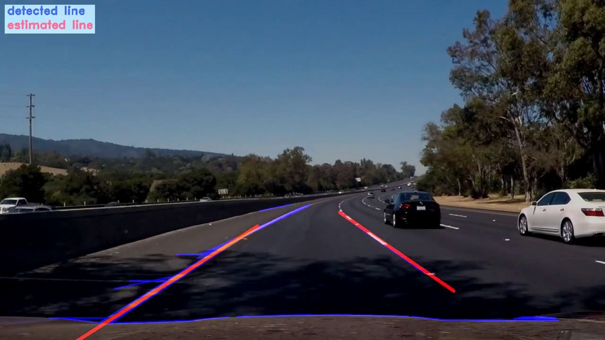
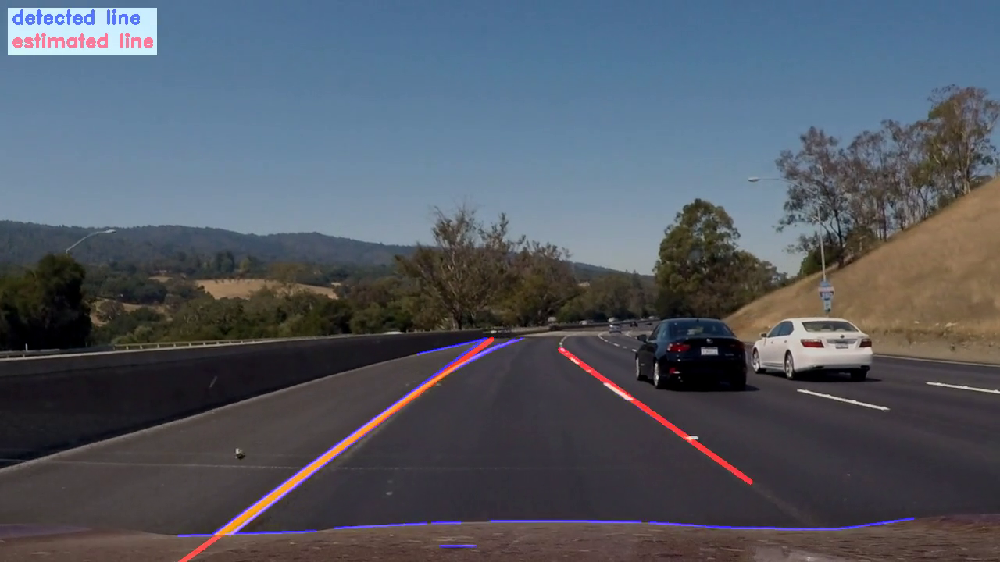
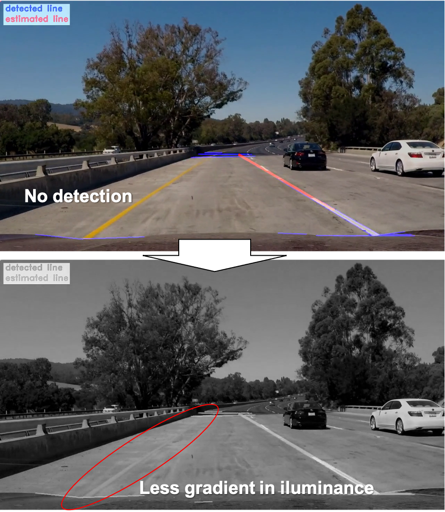

# **Finding Lane Lines on the Road** 

## Writeup for CarND-LaneLines-P1

---

**Finding Lane Lines on the Road**

The goals / steps of this project are the following:
* Make a pipeline that finds lane lines on the road
* Reflect on your work in a written report
---

### Reflection

### 1. Describe your pipeline. As part of the description, explain how you modified the draw_lines() function.

My pipeline consisted of 8 steps. Each step is as follows.

>1) Conver the image to grayscale  
>2) Smooth the image using gaussian filter to reduce noise (kernel size = 5)  
>3) Find the edge using Canny edge detection (low_threshold=50, high_threshold=150)  
>4) Narrow down the region of interest using trapezoid mask to have better line detection  
>5) Find the line using Hough transform  

 
In order to draw a single line on the left and right lanes, I modified the draw_lines() function like following.

>6) Reject the suspecious data by checking magnitude of line gradient (set 0.5 as a mimum gradient otherwise it's rejected)  
>7) Classify each data into left side or right side <>
>8) Estimate the line by using `least square method` to have reasonable estimation result  
>9) Draw detected line & estimated line (detected line: blue, estimated line: red)  
>10) Put the legend in the upper left  

 
Since there were many undesirable edges due to the shadow in optional challenge, '6)' is added as a countermeasure for those edges. Countermeasure was working as expected and could get better estimation like bellow picture.

 

### 2. Identify potential shortcomings with your current pipeline

Potential shortcoming is as follows.

>1) Assume the line is straight  
>-> We used the assumption in Hough transform & least square method. But it's not matched with actual line shape. Below picture is an exaple of this issue.  
>

>
>

>2) Limitation of edge detection using illuminance channel  
>-> We faced the issue that line detection is NOT detected in optional challenge due to less gradient in illuminance. Below picture is an example of this issue.  
>

>
>

 

### 3. Suggest possible improvements to your pipeline

Possible improvement against the issue raised in #2 is as follows.  

>1) Use polynomial or spline approximation  
>-> To have more natural line estimation.  
>2) Use not only illuminance gradient but also color gradient  
>-> To have robust detection performance regardless of lighting condition.  

